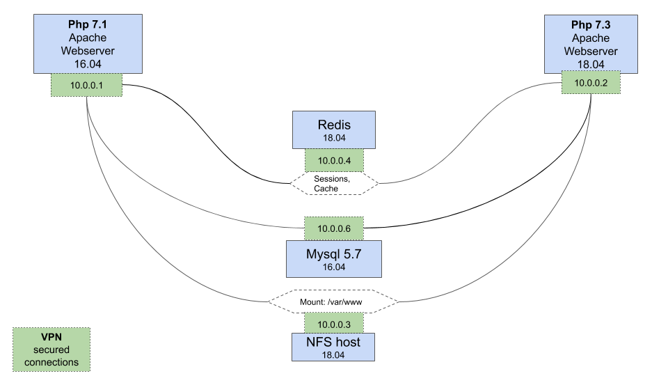

# Molecule Provisioning Example

The story here describes a somewhat experimental (aka not yet officially suggested) way of using Molecule,
and is NOT an introduction to the tool per-se. 
However you might still want to go throght it, to see where it all could be taken to in some more complex flavour. 

### Disclaimer 

I've coded and written this project on a cold Sunday morning between one burst of insomnia and another,
so the thing I need the most is a warming, constructive feedback on how this all could be improved. Please don't hesitate
to suggest updates, as this specific setup is something I've been doing for more than a year now, so a lot of assumed knowledge 
(as well as plain bugs!) might be snuck in here. 
Let's keep it as accessible to Molecule/Ansible newcomers as possible. 

#### Also a note on admin/server side of things

Server-setup roles here are brought from various ends, including by not limited to my own's, 
and I take no responsibility of the final outcome of running any of the scenarios given out here. 
However a stack, very similar to the one presented here, runs happily a production-grade application,
so it did get tested in wild already.  

## Expected Result

Assume we want a stack with 2 webservers. 
To make things more interesting one need to have PHP 7.1, with the other on PHP 7.3,
as we might supposedly be mid migration between versions, and need to test drive the same codebase
with two different flavours.

So we want to provision a webapp cluster, consisting of:

* Webserver with PHP 7.1
* Webserver with PHP 7.3
* Mysql instance connected with webservers
* NFS server connected with webservers
* Redis server providing cache and sessions datasets connected with webservers

All intra-server connections are maintained using simple mesh VPN, 
and the only public-facing interface are webservers' ones.

1. we decided to use https://tinc-vpn.org/ for user-space mesh VPN on LXD clusters,
2. and more to-the-core (and way faster) https://www.wireguard.com/ on actual DO droplets.

In our example the only substantial difference between environments is usage of different VPN mesh tool, 
and not putting maintainers' keys onto LXD instance.
Oh and also, just for the sake of showing how it should be done in live scenarios, 
the `do-cluster` has the `destroy.yml` file tweaked so that it doesn't actually remove any droplet, 
making it impossible to accidentally remove a live stack! 

In concrete apps there can be more changes across clusters,
and this example should give us a good starting point on where main changes can be put in.

Essentially it's crucial to abstract and DRY as many things as possible, and ideally just keep tweaking the `playbook.yml`,
until it works for us. The less moving parts the better. Sometimes we will need a separate group/host vars loaded for 
other scenarios, and that's fine - there's no strict rule about that, other than dedupe, when possible!

General Structure best depicted with this picture:
 
(just don't show to a graphic designer please)

## Motivation to Use Molecule

The premise of molecule is to make testing of Ansible roles and playbooks easier,
and it's built to give us test-driven framework for all our server Ops.

Had you ever taken the concept of server coherency testing to production
you will know how non-trivial it is to keep things in sync when things keep moving.

With Molecule's landscape it's exponentially easier to maintain test-driven approach and manage moving bits.
Let's jump to the actual implementation.

This example shows how to use Molecule to provision basically the same stack (with already said discrepancies) across
LXD containers for dev/testing purposes and onto DigitalOcean droplets for stage/live. 

In Molecule terms we have two `scenarios`:

* do-cluster
* lxd-cluster

We can have as many of those as we need, just need to init using molecule 
(https://molecule.readthedocs.io/en/stable/usage.html#init) and tweak to taste.

Our verifier of choosing for this example is https://github.com/aelsabbahy/goss. 

There's only a scaffold of tests added here, 
again to just let us started where to put things in the end.

## Variables

Please note some variables within `provisioning/inventory/test/group_vars` need to be materialized before usage in
this particular landscape, denoted by `<< >>` wrapping. 
Mainly around variables that point to SSL certs.
It would be easy to get rid of roles needing those, but I wanted to keep it as production-ready as possible,
and thus have kept items that normally one would leave out in basic use cases.

## Setup

The example provides two distinct bootstrap mechanisms (DO provisioning need to use python2.7, due to a dependency), 
which in essence just create appropriate python virtualenv's,
so nothing too fancy. 

for LXD:

    cd provisioning
    ./bootstrap_provisioning.sh
    source provisioningenv/bin/activate 
    
for DO:

    cd provisioning
    ./DO_bootstrap_provisioning.sh
    source DO_env/bin/activate

## Usage

#### Provisioning for LXD

    cd provisioning
    source provisioningenv/bin/activate 
    molecule converge -s lxd-cluster

#### Integration testing for LXD

    cd provisioning
    source provisioningenv/bin/activate 
    molecule verify -s lxd-cluster
 
#### Destruction for LXD

    cd provisioning
    source provisioningenv/bin/activate 
    molecule destroy -s lxd-cluster
 
#### Provisioning for DO

    cd provisioning
    source provisioningenv/bin/activate
    DO_API_KEY=[YOUR DO API KEY] molecule converge -s do-cluster    
    
#### Integration testing for DO

    cd provisioning
    source provisioningenv/bin/activate
    DO_API_KEY=[YOUR DO API KEY] molecule converge -s do-cluster    
   
#### Destruction for DO

    NOP. we've disabled that purposefully for this scenario.

These are just a few sample commands to get us started. 
Head on to https://molecule.readthedocs.io/en/stable/usage.html, to get the full list
of possible commands, just please note some of those aren't fully supported in this example, like `Lint`

## Advanced usage 

#### Only converge webserver

    cd provisioning
    source provisioningenv/bin/activate 
    molecule converge -s lxd-cluster -- --tags=webserver

#### Only setup VPN mesh

    cd provisioning
    source provisioningenv/bin/activate 
    molecule converge -s lxd-cluster -- --tags=vpn-servers
    
The functionality of `tags` come from Ansible itself, and is somewhat similar to writing CSS in the end. 
Make it good and abstract enough and you will own when tweaks have to flow in, or throw it against the wall with no plan,
to be owned eventually...

I think the way we have it done here is a good starting point, and more tags should be added only if needed. Less is definitely better here.

### What is there to change, actually ?
### And how do I get started myself ??

Yes well, basically everything can be changed, but I know that's not helping.

So broadly speaking my recipe is:
* make sure I have `instances` section in `molecule.yml` defined with servers I want
* group them up in a way that make sense
* define default and host-specific tests so you know what is to be wanted (TDD, remember?)
* put in roles for each group in `playbook.yml`
* take note of variables that need to be defined and add them (either on groups or on per-host level)
* converge and verify, repeat until works and passes tests.

## Using in actual projects

Normally I maintain `provisioning` folder with basically exactly the same structure in project. 
Just have a look at simples use-case possible at https://github.com/spottmedia/rust-wasm-starter.

So enabling molecule-driven setup is as easy as copying the `provisioning` folder somewhere into your pojects,
and keeping it there for everyone to use as they need it.

 